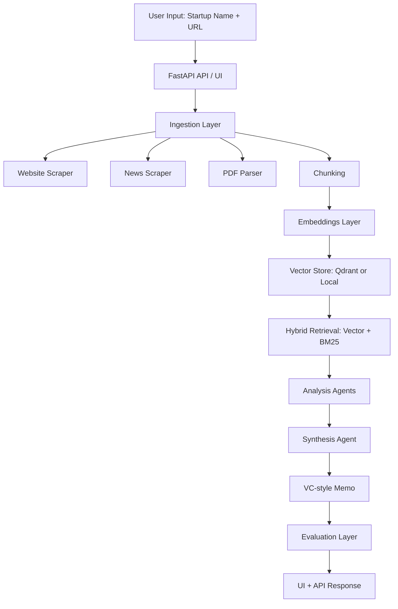

# VentureLens AI

VentureLens AI is a startup due diligence platform focused on AI companies. It collects public information, retrieves the most relevant evidence, runs structured analysis agents, and returns an investor-style report through a web UI and API.

## Project Explanation

### What problem this project solves

Investors and analysts spend significant time manually collecting data from startup websites, news, and public documents before producing a diligence memo. VentureLens AI reduces this manual workload by automating:

- data collection from public sources
- retrieval of the most relevant evidence
- structured assessment across key investment dimensions
- quality checks and runtime metrics

The output is a readable, sectioned report that can be reviewed quickly and compared across companies.

### End-to-end workflow

1. Input: user provides startup name and website URL.
2. Ingestion: system fetches data from website pages, Google News RSS, and optional public PDFs.
3. Normalization and chunking: raw text is cleaned and split into chunk-sized documents with metadata.
4. Embeddings and indexing: chunk vectors are generated and indexed in Qdrant (or in-memory fallback).
5. Hybrid retrieval: vector similarity and BM25 keyword relevance are combined into a final ranking.
6. Multi-agent analysis: dedicated agents evaluate market, competition, traction, and risk.
7. Synthesis: agent outputs are merged into a structured VC-style memo.
8. Evaluation: report quality signals are calculated (relevance, citation coverage, consistency, hallucination risk).
9. Delivery: final report appears in UI and API response with runtime metrics.

### Core components

- `app/ingestion/*`: web/news/PDF data ingestion
- `app/retrieval/chunker.py`: document chunking with overlap
- `app/embeddings/embedder.py`: embedding generation (BGE when available, TF-IDF fallback)
- `app/retrieval/qdrant_client.py`: vector store abstraction (Qdrant or local in-memory)
- `app/retrieval/search.py`: hybrid retrieval scoring (vector + BM25)
- `app/agents/*`: market, competition, traction, risk, and synthesis agents
- `app/evaluation/evaluator.py`: quality scoring and verdict generation
- `app/services/pipeline.py`: orchestration of complete analysis flow
- `app/api/main.py`: API endpoints and web UI

### Report structure

Each analysis returns:

- Market section with score, summary, and evidence
- Competition section with score, summary, and evidence
- Traction section with score, summary, and evidence
- Business model section with score, summary, and evidence
- Risk assessment section with score, summary, and evidence
- Key risk list
- Recommendation
- Evaluation metrics and runtime metrics

### Evaluation and observability

VentureLens includes a lightweight evaluation layer to help detect weak outputs:

- retrieval relevance score
- citation coverage score
- consistency score
- hallucination risk estimate
- judge verdict (`strong`, `acceptable`, `needs_review`)

It also logs runtime metrics for operational visibility:

- latency (ms)
- estimated token count
- estimated cost (USD)

### Reliability decisions

To keep the system usable across local and cloud environments:

- embeddings have a fallback path when heavyweight models are unavailable
- vector storage has a fallback when cloud Qdrant is not configured
- SSL verification is configurable for local troubleshooting versus production safety
- API and UI share one backend, reducing integration drift

## Architecture



## API Endpoints

- `GET /status`: health check
- `GET /ui`: interactive web interface
- `POST /analyze_startup`: startup due diligence report

## Local Run

```bash
python -m venv .venv
. .venv/Scripts/activate
pip install -r requirements.txt
python -m uvicorn app.api.main:app --host 127.0.0.1 --port 8000 --reload
```

Open:
- `http://127.0.0.1:8000/ui`
- `http://127.0.0.1:8000/status`

## Deployment

### Docker

```bash
docker build -f docker/Dockerfile -t venturelens-ai .
docker run --rm -p 8000:8000 --env PORT=8000 venturelens-ai
```

### Render

1. Push repo to GitHub
2. Render -> New -> Blueprint
3. Select repository (`render.yaml` is auto-detected)
4. Set environment secrets:
   - `QDRANT_URL`
   - `QDRANT_API_KEY`
5. Deploy and verify `/status` and `/ui`

## Additional docs

- `docs/DEMO_CHECKLIST.md`
- `docs/TRADEOFFS.md`
- `samples/sample_report_example.json`
- `samples/sample_report_langchain.json`
