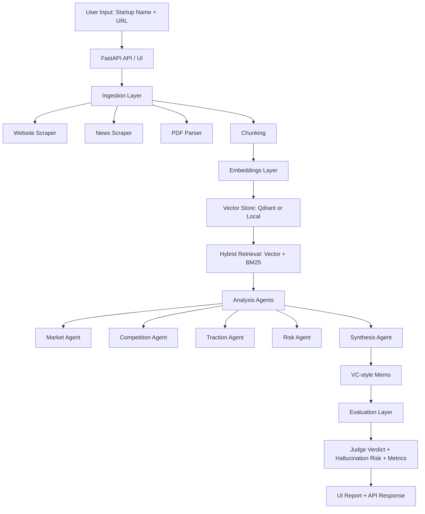

# VentureLens AI

VentureLens AI is an open-weight startup due diligence platform for AI investments.
It automates startup research, hybrid retrieval, multi-agent reasoning, and structured VC-style memos through a cloud-accessible FastAPI service.

## Resume-Ready Summary

Built an AI startup due diligence platform using hybrid retrieval (vector + keyword), multi-agent memo generation, evaluation scoring, and cloud deployment with Docker/Render.

## Current Phase Status

- Phase 0: setup complete
- Phase 1: real data ingestion complete
- Phase 2: hybrid retrieval + multi-agent analysis complete
- Phase 3: evaluation + runtime metrics complete
- Phase 4: Docker + Render deployment complete
- Phase 5: portfolio polish complete

## Architecture



## Features

- Real ingestion from public startup websites, Google News RSS, and public PDFs
- Hybrid retrieval with normalized vector + BM25 scoring
- Multi-agent investment memo sections:
  - Market
  - Competition
  - Traction
  - Business model
  - Risk assessment
- Evaluation outputs:
  - Retrieval relevance
  - Citation coverage
  - Consistency score
  - Hallucination risk
  - Judge verdict
- Runtime metrics:
  - Latency
  - Estimated token usage
  - Estimated cost
- Browser UI and JSON API

## API Endpoints

- `GET /status`: health check
- `GET /ui`: interactive web interface
- `POST /analyze_startup`: startup due diligence report

## Local Run

```bash
python -m venv .venv
. .venv/Scripts/activate
pip install -r requirements.txt
python -m uvicorn app.api.main:app --host 127.0.0.1 --port 8000 --reload
```

Open:
- `http://127.0.0.1:8000/ui`
- `http://127.0.0.1:8000/status`

## Deployment

### Docker

```bash
docker build -f docker/Dockerfile -t venturelens-ai .
docker run --rm -p 8000:8000 --env PORT=8000 venturelens-ai
```

### Render

1. Push repo to GitHub
2. Render -> New -> Blueprint
3. Select repository (`render.yaml` is auto-detected)
4. Set environment secrets:
   - `QDRANT_URL`
   - `QDRANT_API_KEY`
5. Deploy and verify `/status` and `/ui`

## Design Trade-offs

- Embeddings fallback: BGE is preferred, TF-IDF fallback ensures reliability in constrained environments.
- Vector backend: Qdrant preferred in cloud, in-memory fallback keeps local dev friction low.
- Evaluation method: heuristic LLM-as-judge style metrics are fast/cheap but less rigorous than human annotation.
- SSL mode: local default prioritizes practical debugging; production should enforce SSL verification.

## Sample Outputs

- `samples/sample_report_example.json`
- `samples/sample_report_langchain.json`

## Demo Checklist

See `docs/DEMO_CHECKLIST.md`.

## Interview Talking Points

- Why hybrid retrieval outperforms pure vector search for due diligence
- Why structured JSON + UI sections improve reliability and reviewability
- How evaluation metrics help reduce hallucination risk
- How local fallbacks reduced deployment risk while preserving cloud upgrade paths
